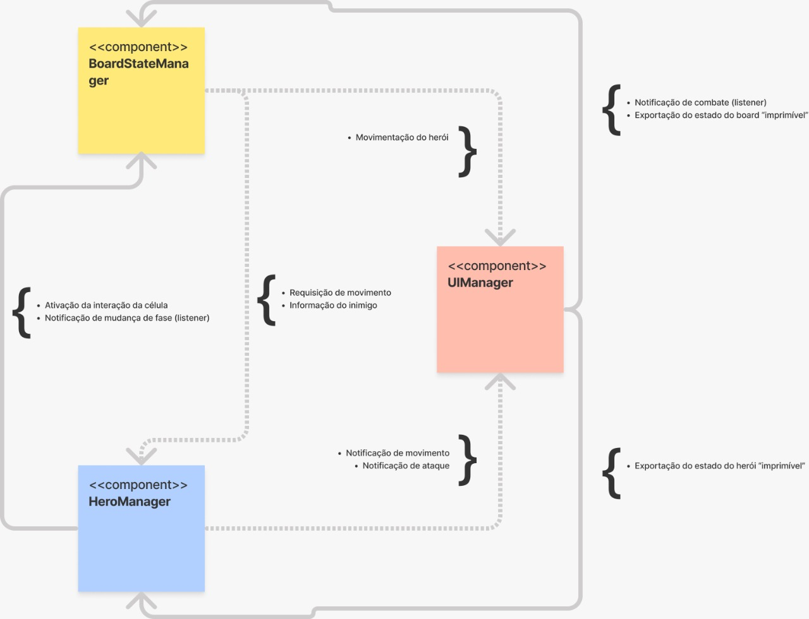
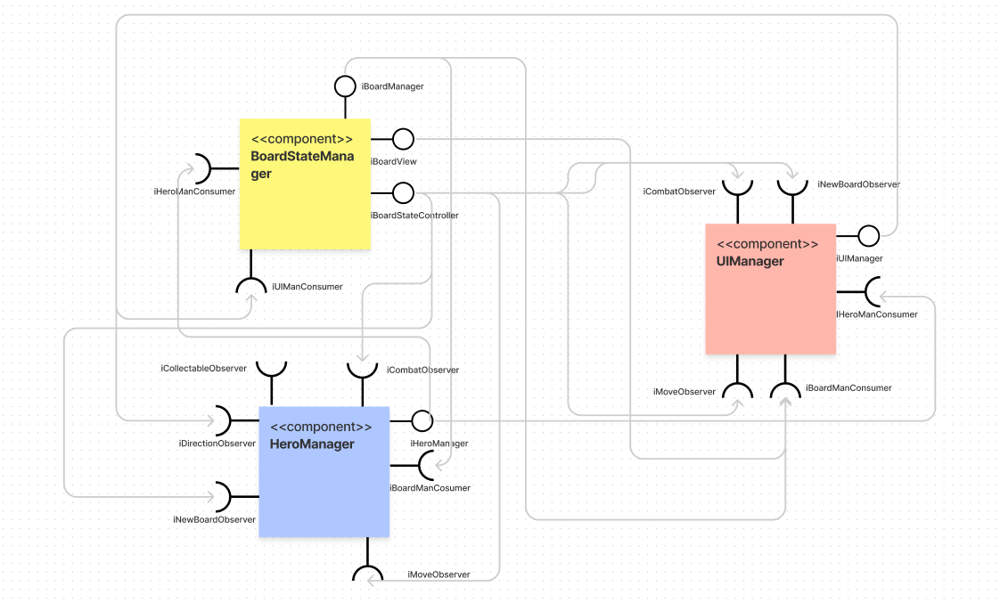
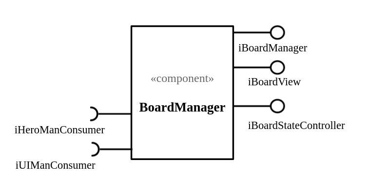
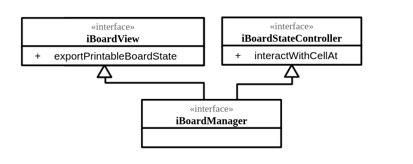
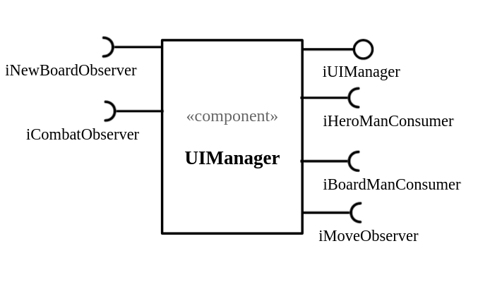
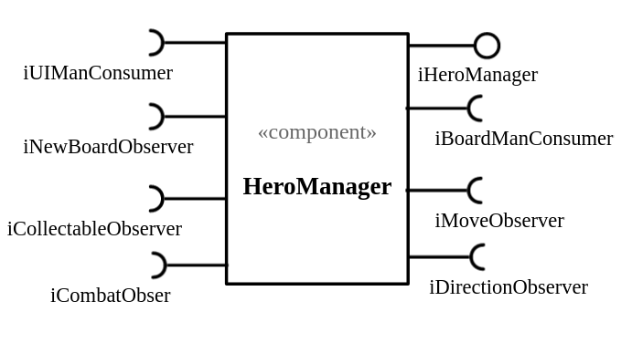
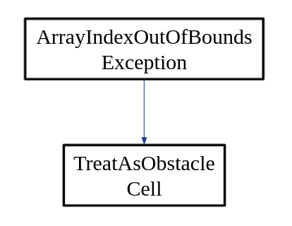

# Apresentação do Projeto

# Projeto `POOtencial Evolutivo`

# Descrição Resumida do Projeto/Jogo

> Um jogo de plataforma cujo objetivo é batalhar com inimigos para adquirir genes que conferem ao jogador poderes especiais.
> O jogador precisa, ao longo das fases, coletar comida para não morrer de fome, pois sua energia decai a cada passo dado.
> O jogo é infinito, com cada fase gerada aleatóriamente. É possível disputar para ver quem vence mais fases.

# Equipe

- `Antonio D. Lucas Junior` - `165677`
- `Gabriel Eiji M. de M. Tomonari` - `234774`

# Vídeos do Projeto

## Vídeo da Prévia

> [Link para o vídeo](https://youtu.be/emUyXbDuNmo)

## Vídeo do Jogo

# Slides do Projeto

## Slides da Prévia

[Link para slides](https://docs.google.com/presentation/d/1TGQ6Ck0ekke8_BBkfZs3BA79ql6gwCWYBMJczihF5yg/edit#slide=id.g35f391192_017)

## Slides da Apresentação Final

## Relatório de Evolução

> O projeto começou com um jogo totalmente diferente. Com uma implementação estilo jogo de damas e com uma arquitetura mais simples. Após feedbacks do professor, resolvemos mudar completamente o projeto e fazer um jogo no estilo RPG.
> Na nossa primeira fase de implementação, nos concentramos na framework JavaFX e na geração automática do tabuleiro. Construímos o mecanismo de colocação dos obstaculos automaticamente, assim como o jogador.
> Na segunda fase de implementação focamos no complemento da inferface, adicionando as informações do personagem, como vida, energia etc. Além disso, construímos a lógica de movimentação do personagem, assim como a lógica de obtenção de comida, perda de energia e ganho de vida.
> Já na última fase de implementação, focamos na lógica de combate e aquisição de genes.

# Destaques de Código

> O PrintableBoardState foi uma maneira elegante que encontramos de desacoplar o tabuleiro da interface gráfica. A partir desta classe, é possível obter uma versão imprimível do tabuleiro, possibilitando trabalhar não com os dados diretos do tabuleiro, mas sim com métodos que obtém os dados de cada célula de maneira dinâmica, permitindo a componentização e fácil modificação ou incremento do jogo.

```java
public class PrintableBoardState {
    private int columnMax = 16;
    private int lineMax = 16;
    private String[][] images;
    private int lineCounter;
    private int columnCounter;
    private boolean hasFinished;

    public PrintableBoardState() {
        this.images = new String[lineMax][columnMax];
    }

    public void appendImage(int i, int j, String path) {
        this.images[i][j] = path;
    }

    public void resetCounter() {
        this.lineCounter = 0;
        this.columnCounter = 0;
        hasFinished = false;
    }

    public int currentLine() {
        return lineCounter;
    }

    public int currentColumn() {
        return columnCounter;
    }

    public String getCurrentImage() {
        return images[lineCounter][columnCounter];
    }

    public void changeToNextImage() {
        columnCounter++;
        if (columnCounter == columnMax) {
            columnCounter = 0;
            lineCounter++;
            if (lineCounter == lineMax) {
                hasFinished = true;
            }
        }
    }

    public boolean shouldPrintNext() {
        return !hasFinished;
    }
}
```

# Destaques de Pattern

> O pattern de Observer permite um funcionamento orientado por eventos. O observable é um emissor de eventos, como por exemplo quando o jogador coleta um item no mapa. O pattern reduz o acoplamento entre duas classes, permitindo fazer isso de forma dinâmica que facilita futuras implementações.

## Diagrama do Pattern

## Código do Pattern

```java
public abstract class BaseObervable<ListenerType, InfoType> {
    protected List<ListenerType> observers = new ArrayList<>();

    public void addObserver(ListenerType observer) {
        this.observers.add(observer);
    }

    public void removeObserver(ListenerType observer) {
        this.observers.remove(observer);
    }

    abstract protected void notifyListeners(InfoType info);
}
```

# Conclusões e Trabalhos Futuros

> Ao longo do projeto tivemos várias ideias que foram despriorizadas por falta de tempo. A primeira e mais simples foi da implementação de gifs animados no lugar do personagem e inimigos. Imaginamos que essa função não seja muito difícil de implementar, mas acabamos não dando prioridade.
> Da mesma forma, acabamos simplificando bastante a lógica de combate por conta do tempo. A ideia inicial era de ter uma interface própria e separada para combate, com uma possível escolha de tipos de ataques, animações etc. Com a arquitetura implementada, não seria muito difícil fazer essas adições, mas acrescentaria bastante tempo de trabalho ao projeto e, por isso, acabamos não o fazendo.
> Por fim, percebemos que a arquitetura proposta através de componentes e suas interfaces permitem a adição de novas funções de maneira muito rápida e sem interferir no funcionamento básico do jogo.

# Documentação dos Componentes

# Diagramas

## Diagrama Geral do Projeto



> Acima o diagrama geral do projeto, considerando componentes principais, interfaces e o fluxo de dados entre eles.

## Diagrama Geral de Componentes

Este é o diagrama compondo componentes para análise:



Para cada componente será apresentado uma descrição detalhada a seguir:

## Componente `BoardManager`

> Componente responsável por gerenciar o estado do Tabuleiro, o estado é uma matriz onde cada célula guarda as informações a serem renderizadas na tela, além disso cada célula guarda as informações de interação do jogo. O componente expõem métodos para interagir com as células, bem como exportar seus estado numa versão simplicada para renderização.



**Ficha Técnica**
item | detalhamento
----- | -----
Classe | `lab07.src.src.BoardManager`
Autores | `Antonio D Lucas Junior` <br> `Gabriel Eiji M. de M. Tomonari`
Interfaces | `iBoardManager` <br> `iBoardManConsumer`

### Interfaces

Interfaces associadas a esse componente:



Interface agregadora do componente em Java:

```java
public interface iBoardStateManager extends iBoardGenerator, iBoardView {

}
```

## Detalhamento das Interfaces

### Interface `iBoardManager`

Interface agregadora, representa o componente BoardManager mencionado anteriormente.

```java
public interface iBoardManager extends iBoardView, iBoardStateController, iHeroManConsumer, iUIManConsumer {

}
```

### Interface `iBoardGenerator`

Interface responsavel pela geração do tabuleiro.

```java
public interface iBoardGenerator extends iNewBoardObservable {

    public void generateNewBoard();

}
```

| Método             | Objetivo                                                         |
| ------------------ | ---------------------------------------------------------------- |
| `generateNewBoard` | `Gera um novo tabuleiro, com as devidas regras de aleatorização` |

### Interface `iNewBoardObservable`

Interface implementada por classes que emitem o evento de novo tabuleiro. Segue o Padrão de Projeto `Observer`

```java
public interface iNewBoardObservable extends iBaseObservable<iNewBoardObserver, NewBoardEvent> {

}
```

### Interface `iBoardLogicController`

Interface impletada por classes que cuidam da gestão logica do tabuleiro.

```java
public interface iBoardLogicController extends iMoveObservable {
    public void generateNewBoard();

    public void replaceHero();

    public void notifyItem(iCollectable info);

    public void notifyCombat(iEnemy info);
}
```

| Método             | Objetivo                                                         |
| ------------------ | ---------------------------------------------------------------- |
| `generateNewBoard` | `Gera um novo tabuleiro, com as devidas regras de aleatorização` |
| `replaceHero`      | `Posiciona o Heroi na posição inicial`                           |
| `notifyItem`       | `notifica aos ouvintes que um item foi coletado`                 |
| `notifyCombat`     | `notifica aos ouvintes que um combate teve inicio`               |

### Interface `iBoardCombatLogic`

Interface impletada por classes emissoras de evento de combate.

```java
public interface iBoardCombatLogic extends iCombatObservable {

}
```

### Interface `iBoardItensLogic`

Interface impletada por classes emissoras de evento de coleta de item.

```java
public interface iBoardItensLogic extends iCollectableObservable {

}
```

### Interface `iBoardStateController`

Interface implementada por classes que fazem a gestão do Estado (Celulas) do tabuleiro.

```java
public interface iBoardStateController {
    public void interactWithCellAt(Position position);
}
```

| Método               | Objetivo                                                        |
| -------------------- | --------------------------------------------------------------- |
| `interactWithCellAt` | `Ativa a interação da celula na posição passada como parametro` |

### Interface `iBoardView`

Interface implementada por classes geram a versão imprimivel do tabuleiro.

```java
public interface iBoardView {
    public PrintableBoardState exportPrintableBoardState();
}
```

| Método                      | Objetivo                                                                                   |
| --------------------------- | ------------------------------------------------------------------------------------------ |
| `exportPrintableBoardState` | `retorna as informações do tabuleiro num objeto que a interface reconhece para renderizar` |

### Interface `iCell`

Interface implementada por classes que representam células do tabuleiro.

```java
public interface iCell {
    public void activateInteraction(iBoardLogicController controller);

    public String getCellImage();
}
```

| Método               | Objetivo                                                                                                                |
| -------------------- | ----------------------------------------------------------------------------------------------------------------------- |
| `activateInteraction | `ativa a interação de uma célula, todas as células possuem uma interação especifica que descrevem as mecânicas do jogo` |

### Interface `iBoardManConsumer`

Interface implementada por toda classe que consuma as funcionalidades do Board Manager.

```java
public interface iBoardManConsumer {
    public void connectBoard(iBoardManager board);
}
```

| Método         | Objetivo                                                                                                    |
| -------------- | ----------------------------------------------------------------------------------------------------------- |
| `connectBoard` | `Obriga o implementador a criar um conexão com o BoardManager, isso permite o acesso aos metodos da classe` |

## Componente `UIManager`

> Componente responsável por gerenciar o sistema de renderização das informações na Interface de Usuário. Suas responsabilidades envolvem, controle de clock, controle de cenas e renderização de imagens.



**Ficha Técnica**
item | detalhamento
----- | -----
Classe | `lab07.src.src.UIManager`
Autores | `Antonio D Lucas Junior` <br> `Gabriel Eiji M. de M. Tomonari`
Interfaces | `iUIManager` <br> `iUIManConsumer`

### Interfaces

Interfaces associadas a esse componente:


Interface agregadora do componente em Java:

```java
public interface iUIManager
        extends iHeroManConsumer, iBoardManConsumer, iMoveObserver, iNewBoardObserver, iCombatObserver {

    public void updateState();

    public void setStage(Stage stage);

    public void render();

    public iUIController getController();
}
```

## Detalhamento das Interfaces

### Interface `iUIManager`

`Interface principal que expõem os métodos para os demais componentes`.

```java
public interface iUIManager
        extends iHeroManConsumer, iBoardManConsumer, iMoveObserver, iNewBoardObserver, iCombatObserver {

    public void updateState();

    public void setStage(Stage stage);

    public void render();

    public iUIController getController();
}
```

| Método          | Objetivo                                                                                                                                                                                        |
| --------------- | ----------------------------------------------------------------------------------------------------------------------------------------------------------------------------------------------- |
| `updateState`   | `Atualiza o estado que deve ser exibido`                                                                                                                                                        |
| `setStage`      | `seta o stage inicial do JAVAFX, necessário para a utilização do framework, o stage representa a janela exibida para o usuário. Além disso realiza configurações da tela como tamanho e título` |
| `render`        | `renderiza o estado atual na interface para o usuario, chamada a cada pulso de clock`                                                                                                           |
| `getController` | `retorna a referência para o controlador da interface`                                                                                                                                          |

### Interface `iUIController`

Interface implementada por classes que gerenciam a logica de teclado da UI.

```java
public interface iUIController extends iDirectionObservable, iDeathObserver {
    public void configKeyBoard();
}
```

| Método           | Objetivo                                                                                                      |
| ---------------- | ------------------------------------------------------------------------------------------------------------- |
| `configKeyBoard` | `Declara a configuração inicial do teclado, faz com que a Interface reaja as teclas precionadas pelo usuário` |

### Interface `iDirectionObservable`

Interface implementada por classes emissoras de eventos de Direcionamento, classes que indica para o herói com qual direção deve interagir.

```java
public interface iDirectionObservable extends iBaseObservable<iDirectionObserver, Direction> {

}
```

### Interface `iUIManConsumer`

Interface implementada por classes que possuem algum tipo de conexão com a UIManager.

```java
public interface iUIManConsumer {
    public void connectUI(iUIManager uiManager);
}
```

| Método      | Objetivo                                                                                               |
| ----------- | ------------------------------------------------------------------------------------------------------ |
| `connectUI` | `Obriga a classe que implementa a se conectar a UIManager, permitindo acessar os métodos dessa classe` |

## Componente `HeroManager`

> Componente responsável por gerenciar o estado do Herói, bem como fornecer metódos e funções para alterar tais estados.



**Ficha Técnica**
item | detalhamento
----- | -----
Classe | `lab07.src.src.HeroManager`
Autores | `Antonio D Lucas Junior` <br> `Gabriel Eiji M. de M. Tomonari`
Interfaces | `iHeroManager` <br> `iHeroManConsumer`

### Interfaces

Interfaces associadas a esse componente:


Interface agregadora do componente em Java:

```java
public interface iHeroManager {

    public boolean isAlive();

    public PrintableHeroStatus expPrintableHeroStatus();

    public void placeHero();
}
```

## Detalhamento das Interfaces

### Interface `iHeroManager`

`Interface principal que expõem os métodos para os demais componentes`.

```java
public interface iHeroManager extends iDirectionObserver, iMoveObserver, iBoardManConsumer, iNewBoardObserver,
        iCollectableObserver, iCombatObserver, iUIManConsumer {

    public boolean isAlive();

    public PrintableHeroStatus expPrintableHeroStatus();

    public void placeHero();
}
```

| Método                   | Objetivo                                                                                          |
| ------------------------ | ------------------------------------------------------------------------------------------------- |
| `isAlive`                | `informa se a vida do heroi é maior que zero, usada para exebir ou não a mensagem de fim de jogo` |
| `expPrintableHeroStatus` | `retorna uma versão do estado do heroi facilitada para a impressão`                               |
| `placeHero`              | `altera a posição do herói para a posição inicial da sala, por hora setada como (0,0)`            |

### Interface `iCollectable`

`Interface implementada por classes que representam os itens do jogo`.

```java
public interface iCollectable {
    public void activate(iHeroStatus hero);

    public String getImage();
}

```

| Método     | Objetivo                                                                     |
| ---------- | ---------------------------------------------------------------------------- |
| `activate` | `ativa os efeitos de um item, realizando a interação com os status do heroi` |
| `getImage` | `retorna o caminho para a imagem do item, usado para renderização`           |

### Interface `iEnemy`

`Interface implementada por classes que representam os iinimigos do jogo`.

```java
public interface iEnemy {
    public void dealDamageTo(iHeroStatus hero);

    public void receiveDamageFrom(iHeroStatus hero);

    public boolean isDefeated();

    public String getImage();

    public iCollectable dropItem();
}

```

| Método              | Objetivo                                                               |
| ------------------- | ---------------------------------------------------------------------- |
| `dealDamageTo`      | `causa danos ao herói`                                                 |
| `receiveDamageFrom` | `recebe os danos causado pelo heroi`                                   |
| `isDefeated`        | `retorna true se o inimigo foi derrotado`                              |
| `getImage`          | `retorna o caminho para a imagem do item, usado para renderização`     |
| `dropItem`          | `retorna o item que deve ser posicionado quando o inimigo é derrotado` |

### Interface `iHeroStatus`

`Interface implementada por classe que fazem a gestão do estado do heroi`.

```java
public interface iHeroStatus extends iDeathObservable {
    public boolean isAlive();

    public void placeHero();

    public void decreaseHP(int damage);

    public void decreaseEnergy(int damage);

    public void restoreEnergy();

    public void addFood();

    public void moveHero(Position position);

    public void setFacingDirection(Direction direction);

    public int getAtackValue();

    public Position getPosition();

    public PrintableHeroStatus expPrintableHeroStatus();

    public boolean hasGene(GeneType gene);

    public void addGene(GeneType gene);

    public void increaseXP(int value);
}
```

| Método                   | Objetivo                                                               |
| ------------------------ | ---------------------------------------------------------------------- |
| `isAlive`                | `retorna true se o heroi estiver vivo`                                 |
| `placeHero`              | `reposiciona o heroi na posição inicial`                               |
| `decreaseHP`             | `causa dano ao heroi, remove o valor da vida atual`                    |
| `decreaseEnergy`         | `Remove parte da energia do heroi`                                     |
| `addFood`                | `adiciona comida ao heroi`                                             |
| `moveHero`               | `substitui a posição atual do heroi`                                   |
| `setFacingDirection`     | `troca a posição para a qual o herói esta virado`                      |
| `getAtackValue`          | `retorna o valor do atack atual do heroi`                              |
| `getPosition`            | `retorna a posição atual do herói`                                     |
| `expPrintableHeroStatus` | `retorna o estado do heroi num formato facilitado para a renderização` |
| `hasGene`                | `verifica se o herói possui o gene do tipo fornecido`                  |
| `addGene`                | `adiciona o gene fornecido ao herói`                                   |
| `increaseXp`             | `aumenta os pontos de Experiência do Herói`                            |

### Interface `iHeroManConsumer`

`Interface implementadas por classes que precisam de um conexão com o HeroManager`.

```java
public interface iHeroManConsumer {
    public void connectHero(iHeroManager hero);
}
```

| Método        | Objetivo                                                                                                                            |
| ------------- | ----------------------------------------------------------------------------------------------------------------------------------- |
| `connectHero` | `obriga a classe que implementa a ter uma função que a conecta com o HeroManager, disponibilizando as função da classe HeroManager` |

# Plano de Exceções

## Diagrama da hierarquia de exceções



## Descrição das classes de exceção

| Classe                         | Descrição                                                 |
| ------------------------------ | --------------------------------------------------------- |
| ArrayIndexOutOfBoundsException | Exceção básica do java ao acessar um valor fora do ArrayS |
| ObstacleException              | Exceção é tratada como se fosse uma célula de obstaculo   |
