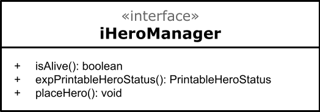

# Apresentação do Projeto

# Projeto `POOtencial Evolutivo`

# Descrição Resumida do Projeto/Jogo

> Um jogo de plataforma cujo objetivo é batalhar com inimigos para adquirir genes que conferem ao jogador poderes especiais.
> O jogador precisa, ao longo das fases, coletar comida para não morrer de fome, pois sua energia decai a cada passo dado.
> O jogo é infinito, com cada fase gerada aleatóriamente. É possível disputar para ver quem vence mais fases.

# Equipe

- `Antonio D. Lucas Junior` - `165677`
- `Gabriel Eiji M. de M. Tomonari` - `234774`

# Vídeos do Projeto

## Vídeo da Prévia

> [Link para o vídeo](https://youtu.be/emUyXbDuNmo)

# Slides do Projeto

## Slides da Prévia

[Link para slides](https://docs.google.com/presentation/d/1r2Jii_VHBkU03k71rF_9ruOg5X7HX8bxM-2oBistcn0/edit?usp=sharing)

# Documentação dos Componentes

# Diagramas

## Diagrama Geral do Projeto


> Acima o diagrama geral do projeto, considerando componentes principais, interfaces e o fluxo de dados entre eles.

## Diagrama Geral de Componentes

Este é o diagrama compondo componentes para análise:


Para cada componente será apresentado uma descrição detalhada a seguir:

## Componente `BoardManager`

> Componente responsável por gerenciar o estado do Tabuleiro, o estado é uma matriz onde cada célula guarda as informações a serem renderizadas na tela, além disso cada célula guarda as informações de interação do jogo. O componente expõem métodos para interagir com as células, bem como exportar seus estado numa versão simplicada para renderização.


**Ficha Técnica**
item | detalhamento
----- | -----
Classe | `lab07.src.src.BoardManager`
Autores | `Antonio D Lucas Junior` <br> `Gabriel Eiji M. de M. Tomonari`
Interfaces | `iBoardStateManager` <br> `iBoardView` <br> `iBoardGenerator`

### Interfaces

Interfaces associadas a esse componente:


Interface agregadora do componente em Java:

```java
public interface iBoardStateManager extends iBoardGenerator, iBoardView {

}
```

## Detalhamento das Interfaces

### Interface `iBoardGenerator`

`Interface que representa classes que gerenciam criação de novos tabuleiros`.

```java
public interface iBoardGenerator {

    public iCell[][] generateNewBoard();
    public void notifyNewBoard();
}
```

| Método             | Objetivo                                                                                                                      |
| ------------------ | ----------------------------------------------------------------------------------------------------------------------------- |
| `generateNewBoard` | `gera um novo estado para o tabuleiro, utilizado para gerar novas fases`                                                      |
| `notifyNewBoard`   | `notifica ouvintes sobre geração de um novo tabuleiro, utilizada para reposicionar heroi e para possíveis animações com a UI` |

### Interface `iBoardView`

`Interface que provida por classe que exportam uma versão do componente para impressão`.

```java
public interface iBoardView {
    public PrintableBoardState exportPrintableBoardState();
}
```

| Método                      | Objetivo                                                       |
| --------------------------- | -------------------------------------------------------------- |
| `exportPrintableBoardState` | `retorna um estado do tabuleiro simplificado para a impressão` |

## Componente `UIManager`

> Componente responsável por gerenciar o sistema de renderização das informações na Interface de Usuário. Suas responsabilidades envolvem, controle de clock, controle de scenas e renderização de imagens.


**Ficha Técnica**
item | detalhamento
----- | -----
Classe | `lab07.src.src.UIManager`
Autores | `Antonio D Lucas Junior` <br> `Gabriel Eiji M. de M. Tomonari`
Interfaces | `iUIManager` <br> `iHeroManConsumer` <br> `iBoardManConsumer`

### Interfaces

Interfaces associadas a esse componente:


Interface agregadora do componente em Java:

```java
public interface iUIManager extends iHeroManConsumer, iBoardManConsumer {

    public void updateState();

    public void setStage(Stage stage);

    public void render();
}
```

## Detalhamento das Interfaces

### Interface `iUIManager`

`Interface principal que expõem os métodos para os demais componentes`.

```java
public interface iUIManager {
    public void updateState();

    public void setStage(Stage stage);

    public void render();
}
```

| Método        | Objetivo                                                                                                                                                                                        |
| ------------- | ----------------------------------------------------------------------------------------------------------------------------------------------------------------------------------------------- |
| `updateState` | `Atualiza o estado da tela, renderizando uma nova cena para o usuário`                                                                                                                          |
| `setStage`    | `seta o stage inicial do JAVAFX, necessário para a utilização do framework, o stage representa a janela exibida para o usuário. Além disso realiza configurações da tela como tamanho e título` |
| `render`      | `renderiza o estado atual na interface para o usuario, chamada a cada pulso de clock`                                                                                                           |

### Interface `iBoardManConsumer`

`Interface que representam classe que precisam estar ligadas a algum iBoardManager`.

```java
public interface iBoardManConsumer {
    public void connectBoard(iBoardStateManager board);
}
```

| Método         | Objetivo                                                                                |
| -------------- | --------------------------------------------------------------------------------------- |
| `connectBoard` | `conecta o UIMager a algum boardManager, permitindo a comunicação entre os componentes` |

### Interface `iHeroManConsumer`

`Interface que representam classe que precisam estar ligadas a algum iHeroManager`.

```java
public interface iHeroManConsumer {
    public void connectHero(iHeroManager hero);
}
```

| Método         | Objetivo                                                                                |
| -------------- | --------------------------------------------------------------------------------------- |
| `connectBoard` | `conecta o UIMager a algum boardManager, permitindo a comunicação entre os componentes` |

## Componente `HeroManager`

> Componente responsável por gerenciar o estado do Herói, bem como fornecer metódos e funções para alterar tais estados.



**Ficha Técnica**
item | detalhamento
----- | -----
Classe | `lab07.src.src.HeroManager`
Autores | `Antonio D Lucas Junior` <br> `Gabriel Eiji M. de M. Tomonari`
Interfaces | `iHeroManager`

### Interfaces

Interfaces associadas a esse componente:


Interface agregadora do componente em Java:

```java
public interface iHeroManager {

    public boolean isAlive();

    public PrintableHeroStatus expPrintableHeroStatus();

    public void placeHero();
}
```

## Detalhamento das Interfaces

### Interface `iHeroManager`

`Interface principal que expõem os métodos para os demais componentes`.

```java
public interface iHeroManager {

    public boolean isAlive();

    public PrintableHeroStatus expPrintableHeroStatus();

    public void placeHero();
}
```

| Método                   | Objetivo                                                                               |
| ------------------------ | -------------------------------------------------------------------------------------- |
| `isAlive`                | `informa se a vida do heroi é maior que zero, usada para continuar o loop do jogo`     |
| `expPrintableHeroStatus` | `retorna uma versão do estado do heroi, facilitada para a impressão`                   |
| `placeHero`              | `altera a posição do herói para a posição inicial da sala, por hora setada como (0,0)` |

## Componente `CombatManager`

> Componente responsável por gerenciar a lógica de combate do jogo, comunica-se com a UI para gerar um interface de combate e com o heroi para atualizar o status durante e após o combate.


**Ficha Técnica**
item | detalhamento
----- | -----
Classe | `lab07.src.src.CombatManager`
Autores | `Antonio D Lucas Junior` <br> `Gabriel Eiji M. de M. Tomonari`
Interfaces | `iBoardCombatManager`

### Interfaces

## (Ainda não implementado)

# Plano de Exceções

## (Ainda não implementado)
